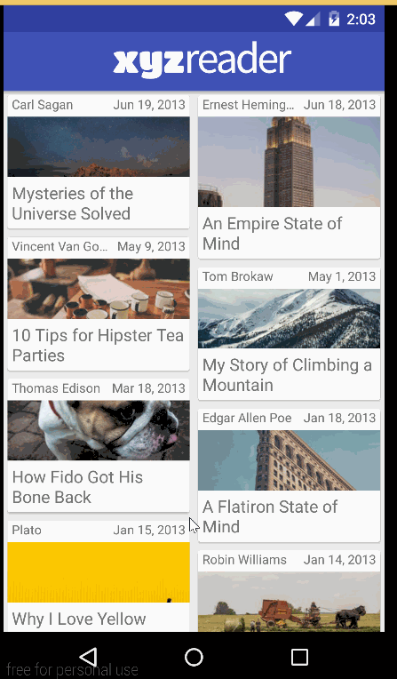

# xyzreader

Description
----
This is an Android app to demonstrate Material Design elements. The app is an article reader for both phone and tablet.

Technical Details
----
- Incorporated Floating Action Button, RecyclerViews and CardViews
- Uses a Collapsing Toolbar with Image
- Activities extend from AppCompatActivity and uses CoordinatorLayout
- Optimized for Tablet

Walkthrough
---

